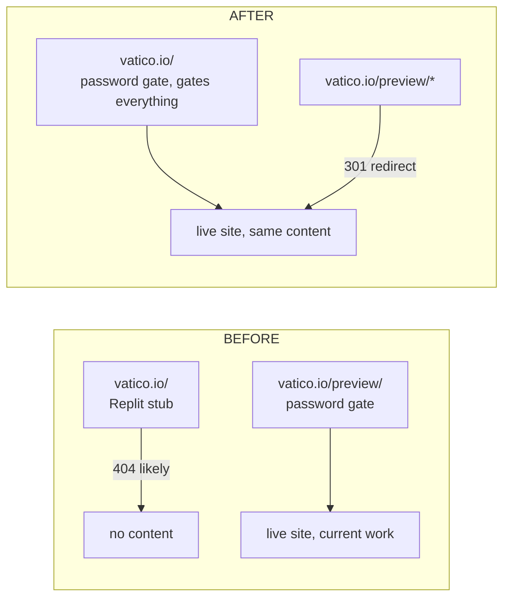

## Audit findings (the "are we ready" answer)

**Perf — no, not yet, but close.**
- Critical render path is healthy: `<head>` is small (12 lines), three stylesheets, no blocking JS, all viz scripts at end-of-body.
- Worst offender is **fonts**. [preview/colors_and_type.css](preview/colors_and_type.css) declares 13 Inter `.ttf` weights plus a full Helvetica Neue LT Std family and Arial. Modern browsers will only fetch the variable font (`InterVariable.ttf`, 880 KB). The Helvetica + Arial `@font-face` declarations point at files that **don't exist in `preview/fonts/`** — silent 404s on first paint. TTF instead of WOFF2 = ~30% bigger than necessary.
- 3.4 MB of dead weight: `preview/uploads/` (3.1 MB) and `preview/screenshots/` (296 KB) — confirmed unreferenced by any executable file. Pure ship-cost waste.
- `preview/Vatico Website (Standalone).html` (4.4 MB) and `preview/Vatico Website v1.html` etc. — historical references, not part of the served site, but currently inside the deploy root.
- Heavy data files (`dma-boundaries.geojson` 1.3 MB, `event-stream.sample.json` 508 KB, `ontology.json` 202 KB) are already lazy-fetched by viz JS, not in the critical path. Cloudflare Pages Brotli/gzip is automatic.

**SEO — no, structurally missing the public-site baseline.**
- Have: title, meta description, viewport, favicon, semantic HTML.
- Missing: canonical URL, OpenGraph (`og:title|description|image|url|type|site_name`), Twitter card, JSON-LD Organization, sitemap.xml, theme-color, apple-touch-icon, web manifest.
- [robots.txt](robots.txt) currently blocks all crawlers (correct while gated). Will flip to selective allow-list when the gate comes off — out of scope for this PR.

**Mobile — partial. CSS pass is done; JS-level work was explicitly deferred.**
- CSS: breakpoints exist at 700 / 760 / 768 / 800 / 900 (inconsistent, will normalize). Touch targets, top-N truncation on V05/V06/V07, viz spacing — already handled.
- JS not done: V02 particle-density / DPR cap on mobile, V03 simulation node-count and freeze-time scaling, V03 touch gestures (pinch-zoom, one-finger pan), V05/V06/V07 lazy-init via IntersectionObserver instead of DOMContentLoaded.
- No real-device testing yet. BrowserStack MCP is available; can drive a structured pass at 360/414/768/1024.

**Gate — works, scope must move.**
- [functions/preview/_middleware.js](functions/preview/_middleware.js) is path-scoped to `/preview/*`. Cookie path `/preview`. SHA-256 + HttpOnly + Secure + SameSite=Lax. Sound.
- For Option B, this moves to `functions/_middleware.js` and the path/cookie scope flips from `/preview` to `/`.

## Architecture (Option B confirmed)

## Phased delivery

The swap and the polish are independent. Ship swap-only first, verify behind the gate, then iterate on perf/SEO/mobile in the public-but-still-gated state.

### Phase A — The swap (this is the gate-preserving promotion)

1. Delete `index.html` at root (227-line Replit stub, no content worth saving).
2. Move `preview/index.html` → `index.html`, `preview/site.css` → `site.css`, `preview/site.js` → `site.js`, `preview/colors_and_type.css` → `colors_and_type.css`, `preview/visuals/` → `visuals/`, `preview/data/` → `data/`, `preview/fonts/` → `fonts/`, `preview/assets/` → `assets/`. (`assets/` already has the v1 logo; will overwrite cleanly — same files.)
3. Delete the unused HTML siblings under preview/: `Vatico Website (Standalone).html` (4.4 MB), `Vatico Website Standalone Src.html`, `Vatico Website v1.html`, `index.v1a-backup.html`. These are historical references already preserved in git history (commit `22706e9` and earlier).
4. Move [functions/preview/_middleware.js](functions/preview/_middleware.js) → `functions/_middleware.js`. Replace `/preview/__logout` → `/__logout`, `Path=/preview` → `Path=/` (cookie scope), and the gate page's form action / link hrefs as needed. Cookie name stays `vatico_preview_auth` so the env var name (`PREVIEW_PASSWORD`) and existing cookies remain valid; users who already authed don't get logged out.
5. Add `_redirects` at root: `/preview/* / 301` so old bookmarks survive.
6. Update [_headers](_headers): replace every `/preview/data/*`, `/preview/visuals/*`, `/preview/uploads/*` rule with the root-relative version (`/data/*`, `/visuals/*`). Keep the inline `_license` injection coverage.
7. Update [robots.txt](robots.txt): drop the `/preview/` Disallow rules (root is now the live path, but the gate makes everything 401 to bots anyway). Keep the AI-crawler block list.
8. Smoke-test: hit `vatico.io/`, see the gate. Submit password, see the new site. Hit `vatico.io/preview/anything`, see 301 → `/anything`, then the gate (or pass-through if cookie present).

**Branch and rollback**: do this on a feature branch (`promote-to-root`). Cloudflare Pages will deploy a preview URL automatically; verify there before merging. Rollback = revert the merge commit; old `/preview/` continues to work because git history is intact.

### Phase B — Perf surgical (this PR, after Phase A merges)

1. **Drop dead weight** (with explicit per-bucket sign-off, not blanket delete):
   - `uploads/` — 3.1 MB, 23 files. Verified zero refs. Recommend: delete from deploy, keep in git history.
   - `screenshots/` — 296 KB, 36 files. Verified zero refs. Recommend: same.
   - Standalone HTML siblings — already removed in Phase A.
2. **Font diet**:
   - Drop the 9 static Inter weight `@font-face` blocks (lines 24–34 of `colors_and_type.css`); keep only `InterVariable.ttf` + `InterVariable-Italic.ttf`. Modern browsers (Chrome 62+, Firefox 62+, Safari 11+, Edge 17+) all support variable fonts. <2% global fallback risk; system-ui kicks in via the existing font-stack chain.
   - Remove the entire Helvetica Neue LT Std `@font-face` block (lines 36–82) and the Arial block (line 85) — the underlying files don't exist in `fonts/`, those are dead 404 declarations.
   - Add `<link rel="preload" as="font" href="fonts/InterVariable.ttf" type="font/ttf" crossorigin>` to `<head>` for the variable font specifically. (Skip WOFF2 conversion this round; flagged as Phase D.)
3. **Defer non-critical CSS**: the visuals stylesheet only matters once visuals are in viewport. Add `media="print" onload="this.media='all'"` pattern with `<noscript>` fallback for `visuals.css`.
4. **Cache headers** in `_headers`: bump `Cache-Control` on `/fonts/*`, `/assets/*`, `/visuals/*.js`, `/visuals/*.css` to `public, max-age=31536000, immutable` (versioned via the existing `?v=N` query strings).
5. **Lazy-init viz**: change V03/V05/V06/V07 init from `DOMContentLoaded` to IntersectionObserver-on-the-figure. Already 90% there for V03, easy refactor for the others.

### Phase C — SEO baseline

Surgical additions to the new `index.html` `<head>`:
- `<link rel="canonical" href="https://vatico.io/">`
- `og:title|description|image|url|type|site_name` (image: a 1200×630 PNG of the cover, generated from the existing SVG mark + tagline; 80 KB target).
- `twitter:card=summary_large_image`, `twitter:title|description|image`.
- `<meta name="theme-color" content="#08090d">`
- `<link rel="apple-touch-icon" href="/assets/apple-touch-icon.png">` (180×180 PNG).
- Minimal `manifest.webmanifest` (name, short_name, theme_color, background_color, icons[192,512]).
- JSON-LD Organization block (name, url, logo, sameAs[]).
- `sitemap.xml` with the single homepage URL (one-pager, no need to be elaborate).

Note: while password-gated, search engines see only the gate page. JSON-LD + OG + canonical still render correctly there for any link-shared previews. Indexability flip happens later when the gate comes off.

### Phase D — Mobile JS density caps + real-device pass

1. **V02 ingest** ([visuals/visual-02-ingest.js](visuals/visual-02-ingest.js)): cap DPR to 1.5 below 768px, halve particle count below 480px.
2. **V03 ontology** ([visuals/visual-03-ontology.js](visuals/visual-03-ontology.js)): below 768px, drop product nodes (depth 4) entirely — graph becomes vertical → manufacturer → brand only. Cuts ~500 nodes and frees the simulation budget. Add basic touch gestures: one-finger pan, pinch-to-zoom (the camera infra from the V03 polish round already supports this; just need touch event handlers wired to it).
3. **V07 whitespace** ([visuals/visual-07-whitespace.js](visuals/visual-07-whitespace.js)): truncate to top-10 below 768px (CSS already does some of this; verify the JS-rendered list matches).
4. **Breakpoint normalization**: collapse 700/760/768/800/900 to a 3-stop set (480 / 768 / 1024). Edits in [site.css](site.css) and [visuals/visuals.css](visuals/visuals.css).
5. **Real-device verification** via BrowserStack MCP: iPhone 14 Pro (390×844), iPhone SE (375×667), Pixel 7 (412×915), iPad Air (820×1180), MacBook Pro 14 (1512×982). Capture screenshots, log issues, fix in the same PR.
6. Lighthouse smoke (Chrome DevTools MCP) on the deployed Cloudflare preview URL: target Performance ≥ 90, A11y ≥ 95, SEO ≥ 90 once gate is open. While gated, only the gate page can be measured — that should still hit 99+ since it's a single form.

## Out of scope for this set of PRs
- Open the gate (set the site public). Separate decision, separate PR.
- Full WOFF2 font conversion. Logged as a future PR, low priority once Cloudflare Brotli is in front.
- Service worker / offline support.
- Contact form backend (currently `mailto:`).
- Analytics integration (no GA/Plausible/etc. currently — flag for separate decision).

## Rollback ladder
- Phase A: revert merge commit. `/preview/` continues to work (git history intact, files still on the previous deploy until cache expires; new deploy goes back to old root stub which is fine because the gate page WAS the homepage to anyone with the URL).
- Phase B–D: independent commits, each revertable individually.