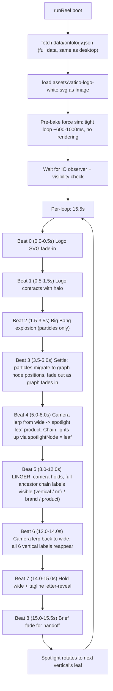

# V03 Mobile — Path A: Animated Desktop Graph

## Why this works
The desktop force graph already has every aesthetic the user asked for: glowing parent circles with outline rings, link lines that visualize the hierarchy, persistent vertical labels, and a chain-highlight pattern (`ancestorIds` / `ancestorEdgeKeys` / `ancestorChain` on `[visuals/visual-03-ontology.js](visuals/visual-03-ontology.js)` lines 57-78) that lights up exactly the path the user wants to see at the deepest zoom. We're not building new visuals — we're driving the existing ones with a beat-sequenced camera and a programmatic "spotlight node."

## Architecture



## Phase 1 — Hoist shared graph code to IIFE scope

Currently `buildGraph`, `step`, `draw`, `colorWithAlpha`, `ancestorIds`, `ancestorEdgeKeys`, `ancestorChain`, and the `parentMap` are all locals inside `init()` (the desktop function). Move them up to the IIFE so both `init()` (desktop) and `runReel()` (mobile) can call them.

Affected file: `[visuals/visual-03-ontology.js](visuals/visual-03-ontology.js)`

- Extract to IIFE-scope functions that take `(nodes, edges)` or `(tree, W, H, opts)` instead of closing over locals.
- `buildGraph(tree, W, H, opts)` returns `{ nodes, edges, parentMap }`. The `opts.skipProducts` flag stays (desktop still uses `true` on small windows; mobile sets `false` since we want products as leaves).
- `stepForceSim(nodes, edges, alphaState, W, H)` — pull `REPULSE`, `LINK_DIST`, etc. into params or shared consts.
- `drawGraph(ctx, nodes, edges, cam, DPR, W, H, opts)` — the existing draw with one new opt: `chainNode` (defaults to `null`). Replaces internal `hoveredNode` reference. Desktop passes `hoveredNode`; mobile passes `spotlightNode`. `activeVertical` filter stays a desktop-only opt.

This is a pure refactor — no behavior change for desktop. Verify by visual diff and console.

## Phase 2 — Replace `runReel()` body

Affected file: `[visuals/visual-03-ontology.js](visuals/visual-03-ontology.js)` lines 700+ (the entire current `runReel` function).

Throw out:
- The hand-rolled hierarchical `WORLD_R_*` constants and `vertPos/mfrPos/brandPos`
- `buildParticles()` and the `makeParticle()` factory's home positions (`homeVx/Vy`, `homeMfrX/Y`, `homeBrandX/Y`)
- `drawBeatVerticalZoom`, `drawBeatMfrZoom`, `drawBeatBrandZoom` (replaced by camera-tour beats)
- `drawMfrLabels`, `drawBrandLabels`, `drawProductLabels`, `cleanLabel` (the desktop's `drawGraph` already handles labels with the chain-highlight pattern)

Keep:
- `runReel(canvas)` outer shell (early return path, IO observer, visibility hook, reduced-motion fallback, resize handler)
- Easing presets (`ease.*`)
- Glow sprite primitives (`buildGlowSprite`, `whiteSprite`, `glowDot`, `bigFlash`) — used by Big Bang particles only
- Particle array for the Big Bang opener (simpler now: only 6 fields per particle, only used during Beats 2-3)
- `drawTypeReveal` (used by tagline)

New state at runReel scope:
```js
let nodes = [], edges = [], parentMap = null;
let logoImg = null;            // assets/vatico-logo-white.svg as Image
let spotlightNode = null;      // the leaf product currently focused
let spotlightSeq = [];         // resolved on data load (see Phase 4)
let spotlightIdx = 0;
let particles = [];            // ONLY for Beats 2-3 (Big Bang -> settle)
let particlesAlpha = 1;        // global fade for particles during settle
let graphAlpha = 0;            // global fade-in for the graph during settle
```

Boot sequence:
1. `fetch('data/ontology.json')` (full data, NOT the curated reel JSON)
2. Load SVG: `logoImg = new Image(); logoImg.src = 'assets/vatico-logo-white.svg'; await logoImg.decode()`
3. Build graph: `({ nodes, edges, parentMap } = buildGraph(tree, W, H, { skipProducts: false }))`
4. Pre-bake force sim — tight synchronous loop until `alpha <= alphaMin` (~500-1000ms blocking, but happens before reel is visible)
5. Resolve `spotlightSeq` (see Phase 4)
6. Set canvas aria-label (full counts)
7. Set up IO observer / visibility / resize hooks (existing)

## Phase 3 — Beat sequencer with linger

Total loop: 15.5s. Cycle: 6 loops × 15.5s = 93s.

```mermaid
gantt
  title Per-loop beat structure (15.5s)
  dateFormat X
  axisFormat %S
  section Opener
  Logo fade-in           :0, 500
  Logo contract          :500, 1500
  Big Bang explosion     :1500, 3500
  section Settle
  Particles -> graph     :3500, 5000
  section Dive
  Camera to leaf         :5000, 8000
  Linger on chain        :8000, 12000
  section Resolve
  Pull back to wide      :12000, 14000
  Hold + tagline         :14000, 15000
  Handoff fade           :15000, 15500
```



New beat draw functions (mobile-only, defined inside `runReel`):
- `drawBeatLogo(p)` — fade-in `logoImg` centered at canvas center via `ctx.drawImage` with global alpha = `ease.quartOut(p)`. Same purple/blue glow halo behind.
- `drawBeatLogoContract(p)` — `logoImg` scales from 1.0 → 0.6, alpha eases out, halo compresses (mirrors current `drawBeatContract`).
- `drawBeatExplosion(p, t)` — same as today, particles burst from world (0,0). Cam stays at (0,0,1).
- `drawBeatSettle(p)` — NEW. Particles migrate from explosion-end positions to a randomly-assigned graph node position (each particle picks a node). `particlesAlpha = 1 - p`. `graphAlpha = ease.quartOut(p)`. By p=1, particles are gone and the full graph is at full alpha.
- `drawBeatDiveIn(p)` — camera lerps from `(0, 0, 1)` to `(centeredOnLeaf.x, centeredOnLeaf.y, leafZoom)`. `spotlightNode = spotlightSeq[loopIdx]` is set at beat start so the chain highlights immediately.
- `drawBeatLinger(p)` — camera holds. Subtle drift: `cam.tx += sin(t * 0.4) * 0.3` for organic feel. The desktop's existing label drawing handles the chain labels (vertical at top of cluster, hovered-node label which we reroute to spotlight chain — see Phase 4 detail).
- `drawBeatPullBack(p)` — camera lerps back to `(0, 0, 1)`. spotlightNode = null in the LAST 20% so chain highlight releases gracefully.
- `drawBeatResolve(p)` — wide hold + tagline reveal via `drawTypeReveal`.
- `drawBeatHandoff(p)` — `graphAlpha *= (1 - p)` so graph fades to black before next loop's logo fade-in.

`tick()` orchestration:
1. Advance clock, pick active beat, advance camera lerp (existing pattern).
2. Clear canvas to `#08090d` (or trail-rgba during Big Bang).
3. If `graphAlpha > 0`: `ctx.save(); ctx.globalAlpha = graphAlpha; drawGraph(ctx, nodes, edges, cam, DPR, W, H, { chainNode: spotlightNode }); ctx.restore();`
4. If `particlesAlpha > 0`: render Big Bang particles via existing `glowDot`.
5. Run beat overlay (logo, tagline, etc.).
6. Call `requestAnimationFrame(tick)`.

## Phase 4 — Persistent ancestor labels at deepest zoom

The desktop's `drawGraph` only labels:
- All `vertical` nodes (always)
- The single `hoveredNode` (with stroked white text)

For mobile linger, we want the FULL chain labeled simultaneously. Add an opt:
```js
drawGraph(..., { chainNode: spotlightNode, labelChain: true })
```

When `labelChain: true` and `chainNode` is set, label every node in `ancestorChain(chainNode, parentMap)` — not just the leaf. This is ~3-5 lines of additional rendering inside the existing label loop, no new helpers needed.

## Phase 5 — Spotlight sequence

Hardcoded list of (vertical, mfr_label, brand_label, product_label) tuples. Resolved at boot to actual node references via lookup over `nodes[]`. Picks reflect the biggest names in each vertical, all confirmed present in `data/ontology.json`:

- **Loop 1 — Injectable**: `Allergan/AbbVie → Botox → "Botox (onabotulinumtoxinA)"` (line 32)
- **Loop 2 — Laser**: `Cutera → AviClear → "AviClear"` (line 698)
- **Loop 3 — Body Contouring**: `Allergan/AbbVie → CoolSculpting Elite → "CoolSculpting Elite"` (line 2116)
- **Loop 4 — Skin Treatment**: `[mfr] → HydraFacial Syndeo → "HydraFacial Syndeo"` (line 3602; resolve mfr automatically via parentMap)
- **Loop 5 — Wellness**: `Novo Nordisk → Ozempic → "Ozempic (Semaglutide)"` (line 4286)
- **Loop 6 — Cosmetic**: `Allergan/AbbVie → Natrelle → "Natrelle Inspira Silicone Implants"` (line 5246)

If any product label is missing or renamed in future data, fall back to the rank-0 product of the rank-0 brand of the rank-0 mfr in that vertical.

## Phase 6 — IP, headers, cleanup

- Mobile now loads `data/ontology.json` (full). Same data exposure as desktop already has. `_headers` already covers `/data/*` so no edits needed.
- `data/ontology.reel.json` becomes orphaned but harmless. Leave file in place; remove the fetch from `runReel`. Optionally remove the file in a follow-up; not part of this plan.
- Update the comment block at `[visuals/visual-03-ontology.js](visuals/visual-03-ontology.js)` lines 22-29 (`init()` mobile branch comment) and lines 702-714 (the runReel header) to reflect the new architecture: "mobile is an auto-camera tour of the same force graph; full ontology is loaded; rendering is canvas-only so DOM exposure is unchanged from desktop."
- Bump JS cache buster on `[index.html](index.html)` line 743 from `?v=9` to `?v=10`.

## Phase 7 — Verification

- Mobile (390x844 viewport) at `127.0.0.1:8000`:
  - Logo SVG renders crisp during opener
  - Big Bang explosion still detonates
  - Particles fade out as graph fades in (no flash gap, no stutter)
  - Camera tour visits all 6 spotlight leaves over 6 loops
  - Chain (vertical → mfr → brand → product) labels all visible during linger
  - Camera pull-back smooth, all 6 verticals labeled at wide
  - Tagline reveals
  - Loops seamlessly
  - DOM check: zero proper nouns leak (only canvas pixels). Verified via the existing snapshot pattern.
- Desktop (1280x900): force graph still works exactly as before — filter chips, hover, drag, wheel zoom, stats overlay.
- Reduced-motion: snap to wide composition with all 6 vertical labels visible, no animation.

## Risk + mitigations

- **Pre-bake force sim blocks main thread ~500-1000ms**: happens before the IO observer fires the reel start, so user only sees a black canvas during the bake. Acceptable. If perceived as a freeze, move to a `setTimeout(0)` chunked loop that runs ~6 steps per tick.
- **734 nodes × camera redraw at 60fps**: desktop already does this; should be fine on mobile. If perf drops, gate the redraw to `dirty` flag (the desktop pattern) — only redraw when camera moves OR spotlight changes.
- **Logo SVG crispness**: `Image` load + `drawImage` rasterizes once. Cache the rasterized bitmap at the right pixel size at boot; no per-frame SVG re-rasterization.
- **Spotlight node label could be off-screen at deep zoom if leaf is at the edge**: the linger camera target is `(leaf.x, leaf.y)` so leaf is always centered. Parent labels (mfr, brand) sit above their nodes via `n.y - n.r - 8/cam.z` and could be off-screen at deep zoom. Mitigation: at high cam.z, fall back to drawing parent labels in screen-space stacked at the top of the canvas (same trick used today for product labels).
