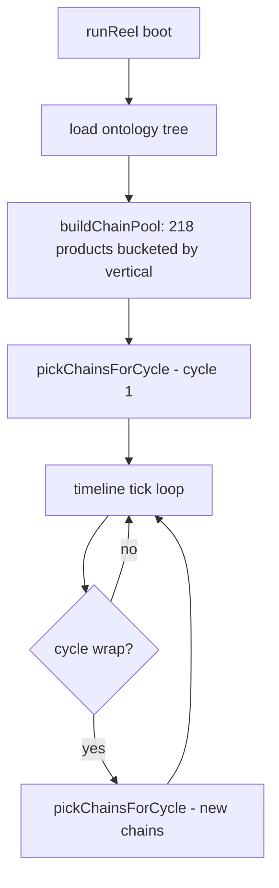

## Scope

Single file change: [visuals/visual-03-ontology.js](visuals/visual-03-ontology.js), inside `runReel()`. Plus a cache-buster bump in [index.html](index.html).

**What stays untouched:** virtual layout (1024x900), timeline state machine, `WIDE_HOLD_S`/`SEG_DUR_S`/`TAIL_DUR_S`/`ACTIVATIONS_S`, camera lerp, `computeNodeFrame`, pulses, `formatCard`/`crossFadeCardTo`, reduced-motion fallback, resize handler, seamless loop.

**What changes:** chain selection only.

## Pool definition (locked)

218 products. At boot, walk the ontology tree once and bucket products per vertical with these rules:
- Skip `mfr` nodes whose label contains "Unattributed" (case-insensitive)
- Skip products whose label ends with `"(Product Line)"`
- Keep everything else, including chains where `brand.label === product.label`

Vertical order is fixed and matches the current order in `CHAIN_DEFS`:
`Body Contouring, Skin Treatment, Wellness, Cosmetic, Injectable, Laser`.

Approximate pool sizes per vertical: Body 25, Skin 40, Wellness 37, Cosmetic 33, Injectable 40, Laser 43.

## Implementation

### 1. Add `buildChainPool(rootNode)` (boot-time, runs once)

Returns `Map<verticalLabel, Array<productNode>>`. Walk `rootNode.children` (verticals) → `mfr` → `brand` → `product`, applying the filter rules above.

```js
function buildChainPool(rootRaw) {
  const pool = new Map();
  for (const v of (rootRaw.children || [])) {
    const arr = [];
    for (const m of (v.children || [])) {
      if (/unattributed/i.test(m.label || '')) continue;
      for (const b of (m.children || [])) {
        for (const p of (b.children || [])) {
          if ((p.label || '').endsWith('(Product Line)')) continue;
          arr.push(p);
        }
      }
    }
    pool.set(v.label, arr);
  }
  return pool;
}
```

Note: `rootRaw` is the raw ontology JSON tree with `children`, NOT the flattened `nodes[]` graph. Make sure we have access to it at boot — currently the reel uses the flat `nodes`/`edges` graph. We'll need to either (a) keep a reference to the raw tree from `loadOntology`, or (b) reconstruct lineage from the flat `parentMap` by grouping `nodes` by `type`. Option (a) is cleaner — pass `tree` through to `runReel`.

### 2. Add `pickChainsForCycle(pool, lastPicks)` (cycle-time)

Picks one product per vertical (in fixed order), walks the parent map to resolve `{ vertical, mfr, brand, product }` node refs, and returns the 6-chain array shaped like the current resolved chains.

- Re-roll once if the picked product matches `lastPicks[vertical]` AND pool size > 1 (avoid back-to-back repeat per vertical).
- Use `parentMap` (already available) to walk product → brand → mfr → vertical for the node refs the timeline expects.

### 3. Wire into the cycle loop

Currently chains are resolved once at boot from `CHAIN_DEFS`. Change to:
- At boot: build `pool` once, call `pickChainsForCycle` for the first cycle's `chains`, compute frames.
- At cycle wrap (where state resets): call `pickChainsForCycle(pool, lastPicks)` again, store as new `chains`, recompute any per-chain derived data (chain edges, etc.). Update `lastPicks`.
- Reduced-motion path: pick once at boot, render statically — no re-roll.

### 4. Remove/deprecate `CHAIN_DEFS`

Delete the hardcoded `CHAIN_DEFS` array. Keep the vertical order as a constant `VERTICAL_ORDER = ['Body Contouring', 'Skin Treatment', 'Wellness', 'Cosmetic', 'Injectable', 'Laser']` to drive `pickChainsForCycle` iteration.

### 5. Cache buster

Bump `visuals/visual-03-ontology.js?v=14` to `?v=15` in [index.html](index.html).

## Mermaid: flow



## Out of scope

- Changing the number of verticals or their order
- Changing animation durations or camera behavior
- Curating "good" vs "bad" chains beyond the 218-pool filter
- Persisting picks across page reloads (each page load starts fresh)
- Excluding chains where brand label == product label (user accepted these are in the pool)

## Risks / notes

- Some 218-pool chains have `brand.label === product.label` (e.g. "AviClear → AviClear"). The card cross-fade will appear to "do nothing" for the last hop. Acceptable per user choice of pool.
- `lastPicks` re-roll is one-shot (re-roll once, accept second draw even if duplicate) to avoid theoretical infinite loop in 1-product verticals. With minimum 25 per vertical, chance of duplicate after re-roll is ~1/625.