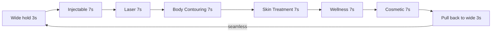

# V03 Mobile — Timeline Reel

## Scope

This plan is **mobile-only**. The desktop visualization is shipped, tested, and untouched. Everything below is additive code in the mobile reel branch (`runReel` in [visuals/visual-03-ontology.js](visuals/visual-03-ontology.js), starts around line 819, gated by `runReel(canvas)` call at line 367) plus two safe additive hooks on the shared renderer that are off by default.

> Stale plans to ignore: `.cursor/plans/v03_mobile_path_a_d37b31a4.plan.md` and `.cursor/plans/v03_mobile_timeline_reel_475be47a.plan.md` are both superseded by this one. Do not read them as guidance.

## Constraints (do NOT do)

The following approaches were tried in earlier iterations and explicitly rejected by the user. Do not reintroduce them:

- **No particle systems** ("Big Bang" opener, ambient dot field, particle migration).
- **No beat-sequenced architecture** (discrete scenes with cuts/jumps). The user said "transitions suck" and "beat is introducing particles, transitions with no parent (jumps), and elements that are outside our style guide." This reel is one continuous camera, no scene transitions.
- **No standalone logo opener** (drawing the SVG to canvas as an intro).
- **No tagline overlays** ("Six verticals. One ontology." text reveals).
- **No Path A "tour" framing** — pre-baked beats jumping between regions.
- **No reduction of the world dimensions** to fix density. Use the virtual world (Phase 1).
- **No edits to `init()`** or anything in the desktop hover/drag/zoom/filter code path.

## What it should feel like

A single continuous shot of the force graph. Camera opens wide (all 6 verticals visible), then quietly pans through one chain per vertical. Each ancestor lights up in sequence with an animated link draw and a brief pulse. A bottom-left info card crossfades to mirror the active node. After the 6th chain, the camera arrives back at the wide composition and the loop crosses without a cut.



Total cycle: ~48s. One continuous camera. No scene cuts.

## Phase 1 — Virtual world layout

Current mobile builds the graph at the tiny mobile canvas size (~434x478), compressing nodes into a blob ("Jackson Pollock"). Fix: **build the graph at virtual world dimensions (1024x900) and use the mobile canvas as a viewport into that world.**

In [visuals/visual-03-ontology.js](visuals/visual-03-ontology.js) `runReel`:
- `WORLD_W = 1024, WORLD_H = 900`
- `buildOntologyGraph(tree, WORLD_W, WORLD_H, { skipProducts: false })` — products included because the leaf is now a product node (Juvederm Vollure XC)
- Pre-bake force sim against virtual dims (existing pattern)
- Wide camera fits world into mobile canvas: `z = min(W/WORLD_W, H/WORLD_H) * 0.92`, `x = (W - WORLD_W*z)/2`, `y = (H - WORLD_H*z)/2`
- `computeChainFrame(node)` already works on world coords — unchanged

**Resize handler:** when canvas W/H change (orientation flip, pinch into address bar), recompute `wideFrame` and re-derive all 6 pre-baked `chain.frame` values. Node positions and `parentMap` do NOT change (they're in world space). Camera mid-pan should snap to the recomputed wide pose to avoid math glitches; reentry to next segment lerps from there.

## Phase 2 — Chain definitions

6 hardcoded tuples resolved at boot to actual node refs. Manufacturer auto-derived via `parentMap`. Fallback to rank-0 product in the vertical if named entity is missing.

- Injectable: Juvederm -> Juvederm Vollure XC (line 81 in `data/ontology.json`)
- Laser: AviClear -> AviClear
- Body Contouring: CoolSculpting Elite -> CoolSculpting Elite
- Skin Treatment: HydraFacial Syndeo -> HydraFacial Syndeo
- Wellness: Ozempic -> Ozempic (Semaglutide)
- Cosmetic: Natrelle -> Natrelle Inspira Silicone Implants

Each resolved record: `{ chain: [vertNode, mfrNode, brandNode, productNode], frame }` where `frame` = bounding-box camera pose for the 4-node chain, computed once post-bake.

## Phase 3 — Timeline state machine + tick

State: `cycleStartMs`, `segIdx` (0..5), `segElapsed`, `chainProgress` (0..4 = how many ancestors lit), `prevPose` (camera snapshot at segment start), `edgeAnims` (Map of edgeKey -> progress 0..1), `activeNode` (most recently activated node, drives the card).

Per-segment timeline (7s each):

- 0.0-2.5s: camera pans from prevPose to chain frame (quartInOut)
- 1.5s: vertical activates (chainProgress 0→1)
- 2.8s: mfr activates (chainProgress 1→2)
- 4.1s: brand activates (chainProgress 2→3)
- 5.4s: product activates (chainProgress 3→4)
- 2.5-7.0s: camera holds on chain frame with ken-burns drift

**On every chainProgress increment from N-1 to N (the "activation" event):**

- `activeNode = chain[N-1]` (deepest lit node)
- Spawn a pulse at `activeNode` (Phase 5)
- Crossfade card to `activeNode` (Phase 6)
- Start an edge animation: `edgeAnims.set(edgeKey(chain[N-2], chain[N-1]), { startMs: now, durMs: 600 })`. Each tick computes `progress = clamp((now - startMs)/durMs, 0, 1)` (eased with quartOut) and writes to `edgeDrawProgress` map passed to `drawOntologyGraph`. The vertex itself (chainProgress=1) has no incoming edge — skip the edgeAnim there.

Ken-burns drift from the current implementation stays (subtle sin/cos pan + zoom oscillation, ~3% amplitude).

Camera pan between adjacent chains that are far apart routes through the wide pose as a 3-point bridge so the camera never swings wildly across the canvas. "Far" = world-distance between chain centers > 0.5 * WORLD_W.

Loop wrap: when `t >= CYCLE_DURATION_S`, reset state, camera is already at wide pose, seamless. Clear `edgeAnims`, clear card (crossfade to empty), reset `chainProgress=0`.

## Phase 3a — Reduced motion fallback

The existing `runReel` already gates on `window.matchMedia('(prefers-reduced-motion: reduce)')` (line 821). Preserve the gate: when reduced, render a **single static frame** at the wide pose with all chain effects disabled (`chainProgress=0`, no `edgeDrawProgress`, no pulses, empty card). No animation loop, no requestAnimationFrame churn.

## Phase 4 — drawOntologyGraph: two additive opts for the mobile reel

Two new options on the IIFE-scope renderer. Both default to off — when omitted, the function behaves exactly as it does today.

- **`chainProgress`** (number, default = full chain length): only highlight/label the first N ancestors of `chainNode`. `ancestorChainOf` result is sliced to `chainProgress` before deriving `chainIds`/`chainEdges` and the label loop.
- **`edgeDrawProgress`** (Map of edgeKey -> 0..1, default = full): for chain edges only, draw length is multiplied by the factor: `ctx.lineTo(a.x + (b.x-a.x)*p, a.y + (b.y-a.y)*p)`. Non-chain edges unaffected.

"Parent labels stay lit" falls out for free: `chainProgress` grows monotonically within a segment, so once a node enters the chain it never leaves until the segment ends.

## Phase 5 — Activation pulse

One expanding ring per activation, ~5x node radius over 700ms, additive blend, screen-space (drawn after drawOntologyGraph so it stays crisp at any zoom). Array of `{ node, born, lifeMs }`, GC'd when expired.

## Phase 6 — Info card (mobile-only)

The `#ontology-label` slot at [index.html](index.html) line 281 already exists in the DOM but is hidden on mobile by a single CSS rule. Two changes:

1. **CSS**: in [visuals/visuals.css](visuals/visuals.css) line 803, drop `.viz-overlay-bl` from the mobile-hide selector list. Other overlays (`-tl` filter chips, `-tr` zoom controls) stay hidden. The CSS classes that style the card content (`.onto-info-name`, `.onto-info-meta`, `.onto-info-trail`) are global and already correct.
2. **JS (inside `runReel` only)**: a self-contained `formatCard(node)` helper builds the same HTML structure (name + meta + trail) so the existing classes give it the right look. `crossFadeCardTo(node)` does a 160ms opacity-out, swaps `innerHTML` via `formatCard(node)`, then opacity-in. Card clears on segment end / loop wrap. Driven from the activation hook in Phase 3 — `activeNode` change triggers the crossfade.

**HTML structure to mimic** — read `updateInfoPanel` at [visuals/visual-03-ontology.js](visuals/visual-03-ontology.js) lines 509-536 as a **read-only reference**. Do not modify or refactor it. The mobile `formatCard(node)` produces equivalent output:

```
<div class="onto-info-name" style="color:{node.color}">{node.label}</div>
<div class="onto-info-meta">
  <span class="onto-info-type">{node.type}</span>
  · <span class="onto-info-count">{N manufacturers|brands|products}</span>
</div>
<div class="onto-info-trail">{ancestor labels joined with " › "}</div>
```

`escapeHtml` is already in scope (used by desktop). `ancestorChainOf(node, parentMap)` is the IIFE-scope helper (filter out root, filter out self, map to label).

IP note: this puts the active node's label into the mobile DOM. The user explicitly asked for the card and called it "awesome" — flagged as a documented decision.

## Files touched

- [visuals/visual-03-ontology.js](visuals/visual-03-ontology.js) — rewrite `runReel`; add two opt-in params (`chainProgress`, `edgeDrawProgress`) to `drawOntologyGraph` (both default off, no behavior change when omitted)
- [visuals/visuals.css](visuals/visuals.css) — drop `.viz-overlay-bl` from the mobile-hide rule (line 803)
- [index.html](index.html) — bump JS cache buster `?v=11` to `?v=12`

No edits to `init()`, no changes to desktop interaction code, no shared formatters refactored.

## Verification

- Mobile (390x844): full ~48s cycle. Wide opens readable, camera continuous, all 6 chains light up V/M/B/P sequentially, animated link draw, pulse on each activation, parent labels persist, card crossfades, loop wraps seamlessly, no console errors
- Reduced-motion: snap to wide composition, all 6 vertical labels visible, card empty, no animation
