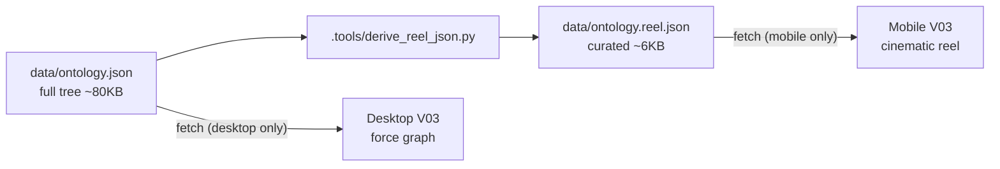

# V03 Mobile — Big Bang Ontology Reel

## What this is

On phones (`window.innerWidth < 768`), V03 stops trying to be an interactive graph. Instead it plays a **~15-second auto-looping cinematic motion graphic** painted on the same `<canvas>`: a bottom-up emergence of the ontology that lands in a brand-callback constellation and a rotating spotlight on real manufacturer/brand names.

No taps. No drill. The data tells its own story.

Desktop is **untouched** — full interactive force graph stays exactly as-is.

## Why this is the answer

- Force-graph drag-zoom needs space the phone doesn't have
- Radial sub-views with labels can't fit 30-40 manufacturer names
- DOM card list dumps every name into page source — wrecks the IP protection we built
- A timed reel sidesteps all three: motion shows one slice at a time, **canvas keeps text out of the DOM**, and a curated subset means **the full ontology JSON is never fetched on mobile**

## Concept: "Big Bang" — bottom-up emergence

Zero data-viz cliché. The data turns into a creation myth. From a single point, 437 product specks explode outward, then *self-organize* via simulated gravity — products into brands, brands into manufacturers, manufacturers into the 6 colored verticals. The 6 verticals settle around a faint Vatico mark. Then a tight spotlight beat reveals real manufacturer and brand names from one rotating vertical, then a wide pull-back and the tagline.

Scale is *felt*, not stated. You see 437 points fly. You don't have to read "437 products" — the screen tells you.

## Data flow



The full `ontology.json` is **never requested on mobile**. The reel pulls a slim derived file with just what the timeline needs.

## Curated subset shape (`data/ontology.reel.json`)

```json
{
  "_license": "(c) 2026 Vatico, LLC. All rights reserved. ...",
  "_generated": "2026-04-28T...",
  "totals": { "verticals": 6, "manufacturers": 147, "brands": 273, "products": 437 },
  "verticals": [
    {
      "label": "Injectable",
      "color": "#e74c3c",
      "mfrCount": 11,
      "brandCount": 22,
      "productCount": 38,
      "topMfrs": [
        { "label": "Allergan/AbbVie", "brandCount": 3, "topBrands": ["Botox", "Juvederm Voluma", "..."] }
      ]
    }
  ]
}
```

**IP posture details:**

- ~30 manufacturer names total (5 per vertical x 6) — vs 147 in the full tree
- ~90 brand names total (3 per top-mfr x 30) — vs 273 in the full tree
- **Zero product names** — products are particles in the visualization, identified only by count. The ~437 leaf points are unnamed pixels.
- License block injected (`_license`)
- Headers (`X-Robots-Tag: noindex, nofollow, noai`, `Cache-Control: no-cache, no-store, must-revalidate`) added in [_headers](_headers)
- Names rendered as canvas text — not in DOM, not in source view, not in screen-reader tree (an `aria-label` summary is set on the canvas)

## Reel timeline (~15s loop, spotlight rotates each loop)

| Beat | Time | Content |
|---|---|---|
| 0 | 0.0-0.5s | Black field. Vatico mark fades in, centered, soft glow. |
| 1 | 0.5-1.5s | Mark contracts toward a single point at center, holds (anticipation). Subtle particle-field background fades in. |
| 2 | 1.5-3.5s | **Explosion.** 437 product specks fly outward from center on physics trajectories with mass-based velocity, drag, slight noise-field perturbation. Distribute organically across the canvas. |
| 3 | 3.5-5.5s | Specks cluster — gravity pulls them into 273 brand groupings. Tight, organic, audible-feeling. |
| 4 | 5.5-7.5s | Brand clusters consolidate into 147 manufacturer constellations. |
| 5 | 7.5-9.5s | Manufacturer constellations migrate to 6 colored vertical galaxies and settle into the final ring. Faint Vatico mark glows behind, center. |
| 6 | 9.5-13.5s | **Spotlight.** Camera eases toward the spotlight vertical (rotates each loop: Injectable -> Laser -> ...). Other verticals dim. Top 5 manufacturer names slide in with letter-reveal. Their top brand names appear as a brief secondary layer. |
| 7 | 13.5-15.5s | Camera pulls back to wide. Tagline letter-reveals: **"Every product. Every brand. Tracked."** Hold. Seamless tail handoff to Beat 0 of next loop with a fresh RNG seed so each loop varies subtly. |

After 6 loops every vertical has been the spotlight. Total cycle ~93s.

## Craft inventory — the difference between mediocre and stunning

The plan commits to this level of detail. Without it the reel will look like every other data viz on the internet.

| Element | What this means concretely |
|---|---|
| **Easing** | `cubic-bezier` presets stored as a small lib. `easeOutExpo` for the explosion. `easeOutBack` (slight overshoot) for the consolidation snaps. `easeInOutQuart` for camera dollies. No `linear`. No default `ease`. |
| **Particles** | Each particle has `mass`, `vx`, `vy`, `drag`. Initial velocities sampled from a normal distribution scaled by mass (heavier = slower). A 2D Perlin noise field perturbs trajectories during the explosion so it doesn't look like a uniform spray. |
| **Type entry** | Letter-by-letter reveal with per-letter slide-up (8px) and tracking unwind (start at +0.4em, settle to natural). Stagger 28-40ms per letter. Letters fade in with `easeOutQuart`. |
| **Color** | Each "galaxy" has a multi-stop radial gradient (core -> mid -> halo) and a soft additive glow halo drawn as a separate layer with reduced alpha. Verticals look luminous, not flat. |
| **Camera** | Position + zoom lerp toward target with `easeInOutQuart`. Anticipation: before a push-in to the spotlight vertical, camera pulls back ~5% briefly (~150ms) before pushing in. Like a real DP would. |
| **Composition** | Spotlight beat positions the focused vertical at golden-ratio (61.8% from left), not center. Reads as cinematic, not corporate. |
| **Rhythm** | Beats are not evenly spaced. The explosion gets a hard accent (sharp), the consolidations have a sustained breath (medium), the spotlight has dwell (slow), the resolve has a final exhale (slowest). Faked musical timing. |
| **Loop** | No hard cut at end. Final frame of Beat 7 holds for ~400ms then the next loop's Beat 0 starts with the mark fading in *over* the held final frame, then the constellation fades to black behind it. Seamless. |
| **Variation** | Each loop uses a fresh RNG seed (incrementing). Particle trajectories differ. Final settled positions are similar but not identical. The eye notices the alive-ness without conscious detection. |
| **Glow halos** | Drawn via `globalCompositeOperation = 'lighter'` for additive blending, scoped to the galaxy layer only. Restored after. |
| **Anti-banding** | Subtle dithering on gradient backgrounds via `Math.random() * 2 - 1` alpha jitter on a noise overlay. Prevents 8-bit color banding on cheap mobile displays. |

## Build approach: checkpoint-first

This is hard to get right blind. The build splits at the explosion + start of consolidation:

1. Rollback rejected code
2. Build curated data + headers
3. Build reel skeleton + craft primitives
4. **Build Beats 0-2 (mark, contract, explosion). STOP. Show the user.** Screen recording or live preview link.
5. If approved -> continue to Beats 3-7
6. If not approved -> course-correct on visual direction with concrete feedback before sinking more time

This is the [`beats-0-2-checkpoint`](beats-0-2-checkpoint) to-do. Other beat to-dos are gated on it.

## Files changed

### New

- [data/ontology.reel.json](data/ontology.reel.json) — derived curated subset (~6KB)
- [.tools/derive_reel_json.py](.tools/derive_reel_json.py) — idempotent generator script

### Modified

- [visuals/visual-03-ontology.js](visuals/visual-03-ontology.js)
  - **Remove** all rejected mobile drill code: `mobileViewState`, `originalTree`, `touchTap`, `TOUCH_TAP_SLOP`, `makeNode`, `buildMobileRootView`, `buildMobileVerticalView`, `buildMobileManufacturerView`, `renderBreadcrumb`, `navigateMobile`, `handleMobileTap`, breadcrumb click delegation, tap detection in touch handlers, mobile-specific hint text
  - **Add** a `runReel()` path branched at the top of init: when `mobileMode` is true, fetch `data/ontology.reel.json` instead of `data/ontology.json`, hide `#ontology-filter`, `#ontology-stats`, `#ontology-label` overlays, and start the timeline animation
  - The reel uses the same `<canvas>` element, its own draw loop driven by `performance.now()`, beat-sequenced render functions, IntersectionObserver to start/stop on viewport enter/exit, `document.visibilitychange` to pause when the tab is hidden, `prefers-reduced-motion` to render a static end-frame
  - Sets `canvas.setAttribute('aria-label', '...')` with a verbal summary for screen readers (counts only, no proper nouns)
- [visuals/visuals.css](visuals/visuals.css)
  - **Remove** the breadcrumb-host CSS, the canvas-list scaffolding (`.onto-canvas-list`)
  - **Keep** the mobile frame height bump (480px / 440px) and the hide-filter-chips rule
- [index.html](index.html)
  - Bump `visuals/visuals.css?v=9` -> `?v=10`
  - Bump `visuals/visual-03-ontology.js?v=4` -> `?v=5`
  - Update the V03 figcaption sub-text to be honest about the dual experience (one-line: "Hover any node on desktop. Watch the reel on mobile.")
  - Update the `<noscript>` fallback to mention the reel
- [_headers](_headers)
  - Add `/data/ontology.reel.json` to the X-Robots-Tag/Cache-Control/license header set (mirror what `/data/ontology.json` gets)

### Untouched

- [data/ontology.json](data/ontology.json) — desktop still uses it
- All other visuals (V02, V05, V06, V07)
- robots.txt (already covers `/data/`)

## Performance budget

- Canvas: ~360 x 480 CSS px, DPR-capped at 1.5 (existing rule)
- Particle count: 437 product specks + ~30 mfr nodes + ~90 brand nodes + 6 vertical orbs + ~80 ambient particles ≈ ~640 sim bodies max during peak (Beat 5 transition). Well under canvas draw budget at 60fps on mid-range mobile.
- Render only when the reel is in viewport (`IntersectionObserver`)
- Pause when tab hidden (`document.visibilitychange`)
- Reduced-motion: single static composition (final frame of Beat 5 + tagline), no RAF loop

## What this does NOT do

- Does not change desktop V03 in any way
- Does not allow user navigation or interaction on mobile (that's the point — interactivity isn't viable here)
- Does not block scraping of the full ontology JSON for someone who knows the URL — that's a separate concern. This plan reduces mobile's surface area; deeper protection (auth, rate limiting) remains a future-state conversation.

## Editorial choices baked into v1 (easy to tune later)

- Tagline: **"Every product. Every brand. Tracked."**
- Loop length: 15.5s
- Spotlight order: Injectable -> Laser -> Body Contouring -> Skin Treatment -> Wellness -> Cosmetic
- Top-N per spotlight: 5 manufacturers, 3 brands per manufacturer
- Spotlight focal point: golden ratio (61.8% from left) of canvas
