## Source-of-truth model

- **v1** — Claude Design's first pass, 6-section "market intelligence layer" IA. Lives at [preview/Vatico Website v1.html](preview/Vatico Website v1.html) (315 lines). Historical reference only.
- **v1a** — your local edits to v1: 9-section "Aesthetics Index" reframe, no visuals wired. Lives at [preview/index.html](preview/index.html) (494 lines). **In production at `/preview/` behind the password gate. v1a's text is canonical.**
- **v2** — Claude Design's second pass, riffed off v1 (does not know about v1a's text/layout edits). Same 9-section IA + a §0.5 ingest section + all 6 visuals wired in. Lives at [website-v2/Vatico Website v2.html](website-v2/Vatico Website v2.html) (629 lines). Source of visuals only.
- **v3** — this work. Founded on v1a. Imports v2's visuals + supporting markup.
- **Editorial guardrail** — any new text required by the visuals must be supportable by [D:/Clients/Plugin Development/MedSpot-v2/positioning-playbook.md](D:/Clients/Plugin Development/MedSpot-v2/positioning-playbook.md). v1a's existing text is not touched.

## What v2 contributes (concrete diff between v1a and v2)

The diff between [preview/index.html](preview/index.html) and [website-v2/Vatico Website v2.html](website-v2/Vatico Website v2.html) shows v2 adds exactly these things on top of v1a's structure:

1. **One new stylesheet link** in head: `<link rel="stylesheet" href="visuals/visuals.css?v=6">`
2. **One new section** between §00 cover and §01 asset: `<section class="sec-signal">` containing the V02 ingest stage — headline ("From the industry's chatter to a single, queryable taxonomy"), sub, canvas, and foot
3. **One figure** appended to §01 sec-asset: `<figure class="viz viz-ontology">` for V03
4. **One figure** prepended inside §03 sec-catalog (before the catalog-grid): `<figure class="viz viz-leaderboard" id="timeline-root">` for V05
5. **One figure** prepended inside §04 sec-actions (before the actions-list): `<figure class="viz viz-sov" id="sov-root">` for V06
6. **One figure** prepended inside §05 sec-readers (before the readers-grid): `<figure class="viz viz-leaderboard" id="whitespace-root">` for V07
7. **Six new script tags** at the footer (we keep five — drop visual-01-hero-map.js and tweaks.js)

The v2 EDITMODE inline script (`window.VATICO_TWEAKS_DEFAULTS`) is Replit scaffolding and is NOT brought across.

That's the entire structural delta. v1a's cover, §02 alternative, §06 posture, §07 inflection, and §08 door receive no visual additions — same as v2.

## Visual placement (lifted directly from v2)

| Section | Visual added |
|---|---|
| §00 Cover | none — v1a hero stays as-is |
| §0.5 Ingest (NEW) | V02 chatter → ontology → verticals |
| §01 The Asset | V03 ontology force graph |
| §02 The Alternative | none |
| §03 In the Index | V05 trailing-window leaderboard |
| §04 Monday Morning | V06 share-of-voice (3-panel) |
| §05 Who Reads | V07 DMA whitespace leaderboard |
| §06 Posture | none |
| §07 Inflection | none |
| §08 Door | none |

V01 (the chaos→structure US map / ambient field) is retired. `data/locations.anon.json` (2.5 MB) is dropped from the bundle.

## New visual-supporting text to vet against the playbook

These are the text elements that come in from v2 and need a sanity check against `positioning-playbook.md`. My read on each is in parentheses; you have the final word.

- **§0.5 eyebrow:** `· · the inhale` (concrete metaphor, low-key — playbook §3a "concrete nouns over abstract verbs")
- **§0.5 headline:** `From the industry's chatter to a single, queryable taxonomy.` (Pattern E "Stop bad / Start good" frame — chatter is the enemy, taxonomy is the resolution)
- **§0.5 sub:** `Captions, reviews, transcripts, filings, decks. Every primary source the category produces, resolved against one structured ontology of practices, brands, and procedures.` (Komodo-grade fragment rhythm + insider register)
- **§0.5 foot:** `raw · unstructured public signal → → → resolved · entities, brands, procedures` (concrete labels, concrete arrow)
- **V03 figcap:** `fig. 01 / The ontology, drawn. / Six verticals · manufacturers · brands · products. Hover any node.` (rhythmic, insider; "drawn" is concrete past-participle)
- **V05 figcap:** `fig. 02 / Brand leaderboard, by trailing window. / Practice-mention counts and within-vertical share. Switch the window to see how the field re-ranks itself in days, not quarters.` (echoes v1a hero outcome line "in days, not quarters")
- **V06 figcap:** `fig. 03 / Share, the way ad spend is read. / National monthly share among neuromodulators · trend lines · DMA leaderboards.` (Komodo-grade analogy)
- **V06 panel titles:** `Monthly share · trailing 18 months` / `Brand-level trajectories` / `DMA leaders · 24 largest markets`
- **V07 figcap:** `fig. 04 / Whitespace, by market. / A z-score composite of consumer demand against practice supply. Top-ranked DMAs are markets where the category is asked for and underserved.` (insider register; "z-score composite" assumes sophisticated reader)

If you want any line changed, tell me before the corresponding Phase 2 step and I'll substitute your wording.

## What we explicitly do NOT touch

- Any v1a copy in [preview/index.html](preview/index.html) (hero tagline, hero defn, hero outcome, all section eyebrows + headlines + bodies + closes).
- v1a's typographic refinements in [preview/site.css](preview/site.css) (`line-height: 1`, `text-box: trim-both cap alphabetic`, per-line margins on `.hero-tagline .line:nth-child(*)`).
- v1a's [preview/site.js](preview/site.js) (already has the word-reveal + scroll-rail + IO sweep that v2 has).
- v1a's [preview/colors_and_type.css](preview/colors_and_type.css).
- The Cloudflare Pages middleware at [functions/preview/_middleware.js](functions/preview/_middleware.js) (password gate stays).
- v1a's `<header class="hero">` markup. V02 lives below the hero, not in it.

## Out of scope for this pass

- Adopting v2's text edits where they overlap with v1a's text.
- V01 hero map (retired by Decision A — the visual that earned the hero is V02, but it lives in its own breaker section under the hero, not in the hero itself).
- Restoring V07 as a choropleth (designer note: existing GeoJSON only covers the southern half of CONUS; leaderboard is the honest read).
- Production deployment. This is place/optimize/refine — you'll review on the live `/preview/` URL after each phase.

## Phase flow

```mermaid
flowchart LR
    P0[Phase 0: snapshot v1a] --> P1[Phase 1: copy v2 assets into preview/]
    P1 --> P2a[Phase 2a: insert sec-signal ingest section]
    P2a --> P2b[Phase 2b: insert V03 in sec-asset]
    P2b --> P2c[Phase 2c: insert V05 in sec-catalog]
    P2c --> P2d[Phase 2d: insert V06 in sec-actions]
    P2d --> P2e[Phase 2e: insert V07 in sec-readers]
    P2e --> P3[Phase 3: local verification]
    P3 --> P4[Phase 4: a11y + SSR fallbacks]
    P4 --> P5[Phase 5: mobile pass]
    P5 --> Done[Ready for production deploy decision]
```

Each Phase 2 step is one targeted insertion into [preview/index.html](preview/index.html) plus a playbook check on the new text. I'll pause at the end of every phase for your review.
